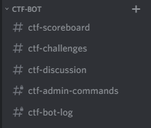

# Discord CTF Bot

Discord sunucumuz için yaptığımız, Discord üzerinde CTF düzenlenmenizi sağlayan bir Discord botu.


# Yukleme

```bash
pip install -r requirements.txt
```

[config.py](./config.py)'i gerekli şekilde doldurun.

## Discord Token

[Creating a Bot Account](https://discordpy.readthedocs.io/en/latest/discord.html#discord-intro) adlı makaleyi okuyup discord tokeninizi alabilirsiniz.

## Kanal IDleri

Gerekli kanalları oluşturup, kanal izinlerini sizin ayarlamanız gerekmekte.

<table>
  <tr>
      <td rowspan="2" ></td>
      <td colspan="2" >Everyone</td>
      <td colspan="2" >Admins</td>
  </tr>
  <tr>
      <td>  Okuma</td>
      <td> Yazma</td>
      <td>  Okuma</td>
      <td> Yazma</td>
  </tr>
  <tr>
      <td>SCOREBOARD_CHANNEL_ID</td>
      <td>:white_check_mark:</td>
      <td>:x:</td>
      <td>:white_check_mark:</td>
      <td>:white_check_mark:</td>
  </tr>
  <tr>
      <td>CHALLENGES_CHANNEL_ID</td>
      <td>:white_check_mark:</td>
      <td>:x:</td>
      <td>:white_check_mark:</td>
      <td>:white_check_mark:</td>
  </tr>
  <tr>
      <td>DISCUSSION_CHANNEL_ID</td>
      <td>:white_check_mark:</td>
      <td>:white_check_mark:</td>
      <td>:white_check_mark:</td>
      <td>:white_check_mark:</td>
  </tr>
  <tr>
      <td>LOG_CHANNEL_ID</td>
      <td>:x:</td>
      <td>:x:</td>
      <td>:white_check_mark:</td>
      <td>:x:</td>
  </tr>
  <tr>
      <td>ADMIN_CHANNEL_ID</td>
      <td>:x:</td>
      <td>:x:</td>
      <td>:white_check_mark:</td>
      <td>:white_check_mark:</td>
  </tr>
</table>



## Veritabanı

Veritabanı olarak istediğinizi kullanabilirsiniz.

5 MB bedava kullanım verdiğinden, heroku add-on'u olan
[heroku.com/addons/jawsdb](https://elements.heroku.com/addons/jawsdb) 'u kullandık.


# TODO
- [ ] Yükleme adımlarını güncelleme(github actions ile çalışıyor)

:heavy_check_mark: Kullanıcı silme ekleme. [mucahitkurtlar](https://github.com/mucahitkurtlar)

:heavy_check_mark: !rank komutuna çözülen challengeları da ekleme.

- [ ] :bangbang::bangbang: Mesaj kanalının database olarak kullanma.
- [ ] :bangbang::bangbang: Sql query'lerini Prepared Statement'lara çevirme.
- [ ] Veritabanında kolaylık açısından kullanıcı ismini de tutma.

:heavy_check_mark: Çeviri kolaylığı için tüm mesajları düzgün formatta toplama.[mucahitkurtlar](https://github.com/mucahitkurtlar), [ilgili PR](https://github.com/AUCyberClub/Discord-CTF-Bot/pull/3)

:x: Github -> Heroku integrasyonunu yapma (iptal edildi)

:heavy_check_mark: config.py'yi çevre değişkenleriyle çalışabilir yapma

- [ ] README.md yi ingilizce yapma
- [ ] Gerekli kanalları otomatik açma ve izinleri ayarlama

:heavy_check_mark: Daha güzel mesajlar atma [mucahitkurtlar](https://github.com/mucahitkurtlar)

